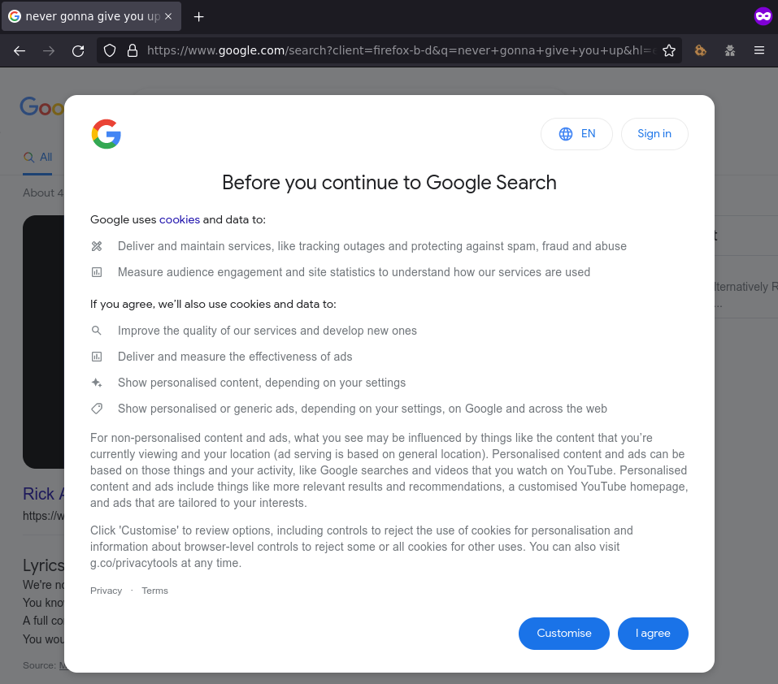
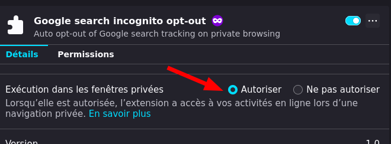

# Google search opt-out for Firefox incognito mode

This Firefox extension allow to automatically opt-out of Google cookies **when using Incognito mode**.

_Without the extension..._

_With the extension_

⚠️ **You must allow the extension to run in Incognito mode** ⚠️

## How it works

When a new private Firefox window is created, it checks if specific Google cookies are set. If they are not, it creates them with values that make it opt-out of Google tracking... I guess. It's a mess. But hey, at least, the prompt is no longer displayed.

## Limitations

- For now, works only for `google.com`, not other Google TLDs.

## License

2022 - Romain RICARD. See [`LICENSE.md`](LICENSE.md) for, well, the license.
